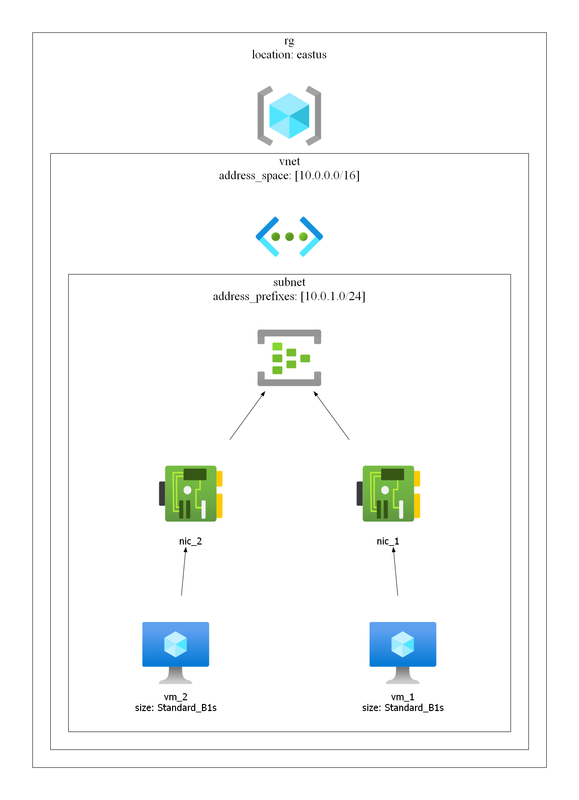
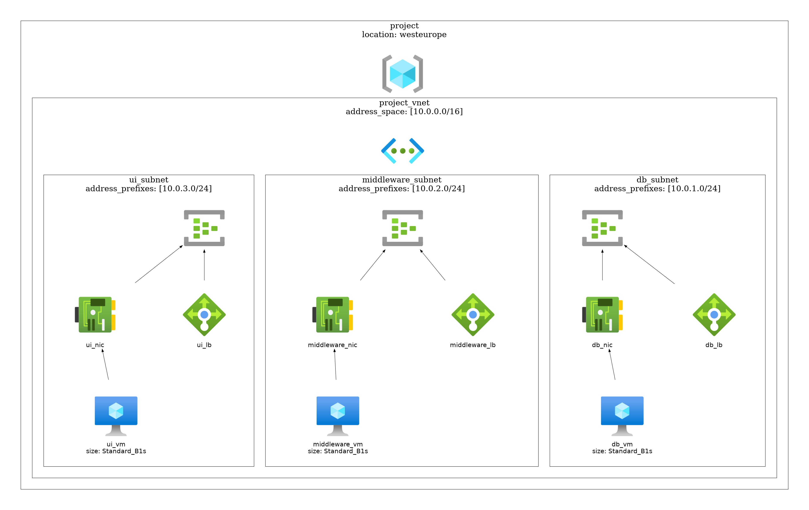

# Terraview


A CLI tool for generating cloud diagrams from Terraform code.
Go from this:

```bash
terraform graph > simple-plan.dot
dot -Tjpeg simple-plan.dot -o diagram.jpg
```

To this:

```bash
terraview print .\terraform_example\ --format png
```

## Current example of generated diagrams 





# Development 

Useful commands for development only.

## Cobra-cli

Add new command:

```bash
cobra-cli add print  
```

## Run code

```bash
go run main.go print .\terraform_example\ --format png

go run main.go print .\terraform_example\ 

dot -Tjpeg diagram.dot -o diagram.jpg
```